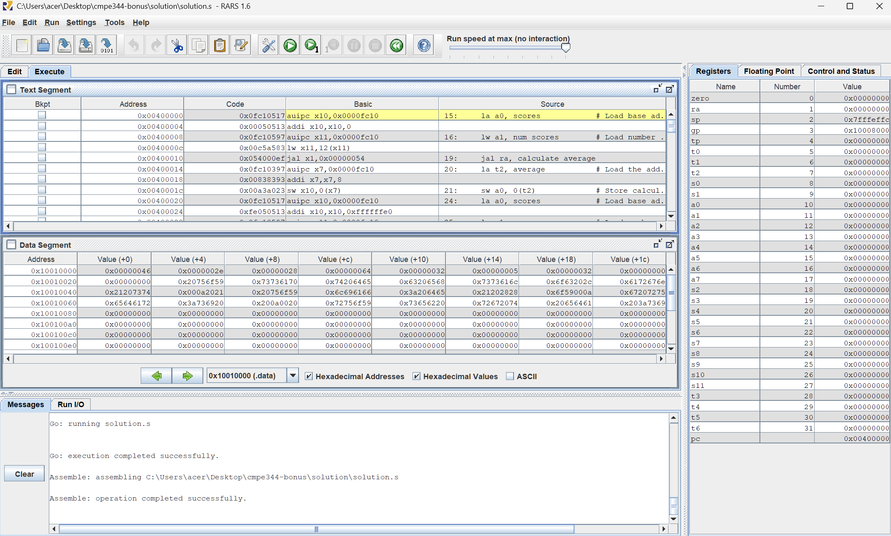
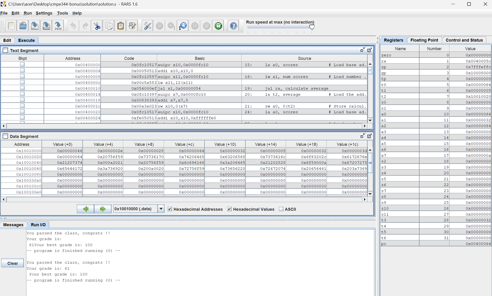

# RISC-V Grading System Simulation

## Overview
This project simulates a basic grading system using RISC-V assembly language. It calculates the average score, finds the highest score, and determines whether the class passed or failed based on a predefined threshold. This is an educational project designed to help my fellow students learn about arrays, loops, conditionals, and modular programming in RISC-V.

## Features
- Calculate the average score from a list of grades.
- Find their highest score.
- Determine if they passed or failed based on a threshold.
- Modular and well-documented code following RISC-V conventions.

## Prerequisites
Before running the project, ensure you have the following installed:
- Java Runtime Environment (JRE): Required to run RARS.
- RARS (RISC-V Assembler and Runtime Simulator): Download it [here](https://github.com/TheThirdOne/rars/releases/tag/v1.6).

## How to Run
1. **Open RARS**:
   - Download and open the RARS.jar file.
2. **Load the Code**:
   - In RARS, load either student.s (starter code) or solution/solution.s (complete code) from the project directory.
3. **Assemble the Code**:
   - Click the **Assemble** button or press F3.
   - Ensure there are no errors in the console.
   - Example:
     
4. **Run the Program**:
   - Click the **Run** button or press F5.
   - The output will be displayed in the console.
   - Example:
     
